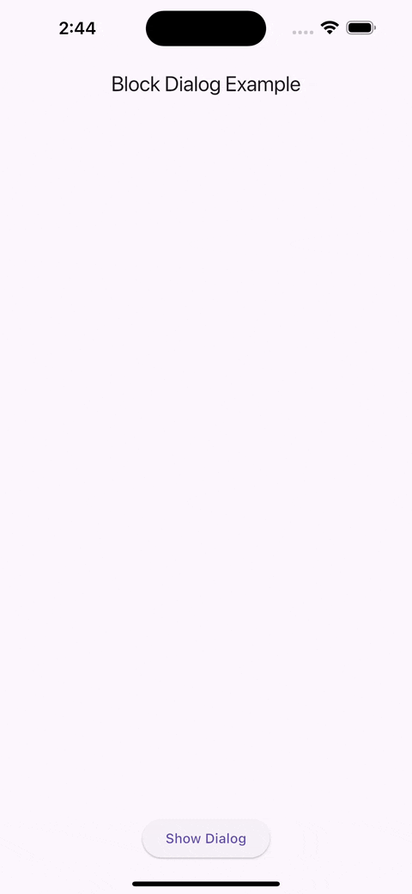
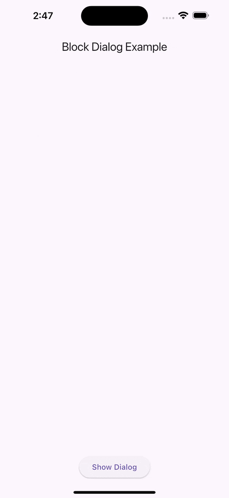

# block_dialog

Block-based, animated dialogs for Flutter with composable layout, typed results, and fine-grained dismissal control.

## Features
- Compose dialogs from rows of blocks (text, buttons, inputs, radio group, checkbox, spacer, custom).
- Typed results with `BlocksResult<T>` and per-block `resultId` keys.
- Multiple built-in block animations with easy customization.
- Animated dimmed background synchronized with dialog animation.
- Per-block overrides for position and animation.

## Install
Add to `pubspec.yaml`:
```yaml
dependencies:
  block_dialog: ^1.0.1
```

## Preview

| Slide | Scale | Cinematic |
|-------------------|-----------------|-----------------|
|  |  |  |

---

## Quick Start
```dart
BlockDialog.show(
  context,
  rows: [
    BlockRow(blocks: [
      BlockText(text: 'Create account?'),
    ]),
    BlockRow(blocks: [
      BlockInputField(resultId: 'email', hintText: 'Email'),
    ]),
    BlockRow(blocks: [
      BlockButton(
        label: 'Continue',
        onPressed: (results) {
          final email = result.get<String>(resultKey: 'email');
        },
      ),
      BlockButton(
        label: 'Cancel',
      ),
    ]),
  ],
);
```

## Blocks
- `BlockText` — simple text/title block.
- `BlockInputField` — text input (use `resultId`).
- `BlockCheckbox` — boolean input (use `resultId`).
- `BlockRadioGroup<T>` — single-choice selection (use `resultId`).
- `BlockButton` — action button (optionally closes the dialog).
- `BlockSpacer` — vertical gap.
- `BlockCustom` — any widget, optionally with `resultBuilder`.

## Styling & Config
```dart
const DialogConfig(
  backgroundColor: Color(0xFFF8FAFC),
  backgroundColorPressed: Color(0xFFE2E8F0),
  strokeColor: Color(0xFFCBD5E1),
  strokeWidth: 1,
  borderRadius: 20,
  blocksSpacing: 6,
  barrierColor: Color(0xB3000000),
  animationDuration: Duration(milliseconds: 420),
  blockAnimation: BlockAnimation.cinematic(),
)
```

## Animations
- `BlockAnimation.slide()`
- `BlockAnimation.scale`
- `BlockAnimation.elastic`
- `BlockAnimation.depth`
- `BlockAnimation.cinematic()`
- `BlockAnimation.expandFromCorner()`

## Results & Dismissal
- Each block that produces a value must provide a unique `resultId`.
- `BlocksResult.dismissReason` indicates how the dialog closed.
- Tapping outside can be enabled/disabled with `barrierDismissible`.

## Custom Blocks
```dart
BlockCustom(
  resultId: 'rating',
  resultBuilder: () => 5,
  builder: (context, controller, configs) {
    return const Center(child: Text('Custom')); 
  },
)
```

## Example Project
See the `example/` folder for a full working demo.

---

## Additional Information

- **GitHub:** [https://github.com/tripletroop/flutter_block_dialog](https://github.com/tripletroop/flutter_block_dialog)  
- **Pub.dev:** [https://pub.dev/packages/block_dialog](https://pub.dev/packages/block_dialog)

### Contributing

1. Fork the repository
2. Create a feature branch
3. Submit a pull request
4. Include tests for new features

### Issues

- File issues on GitHub  
- Include Flutter/Dart version and error details  
- Expect response within 1–3 business days

---

## License

MIT License. See [LICENSE](LICENSE) file.
